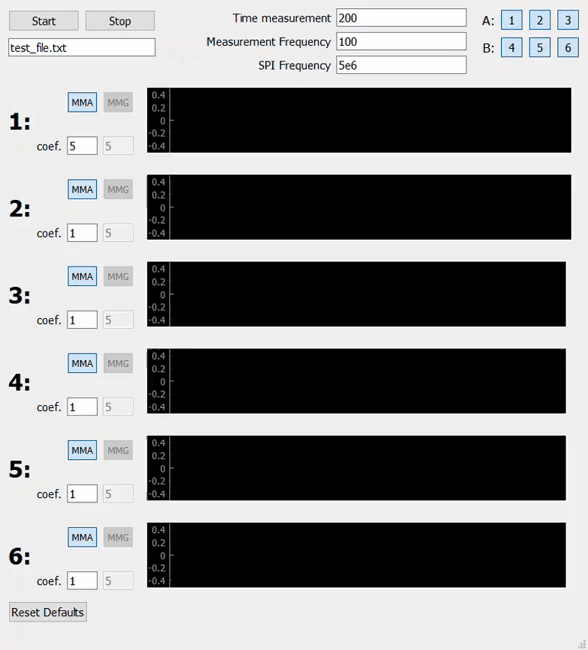

# highfrequency_data_visualization
Real-time visualization of high-frequency data from SPI interface, from multiple devices.
Features:
- Multithreading for data visualization, converstion and writing to file
- GUI (written in PyQt) for up to 6 micromechanical sensors (each one can be either Accelerometer or Gyroscope)

(Developed in 7 days, Qt part is messy)
